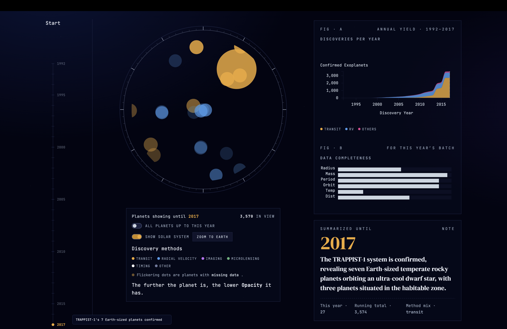

# Through the Lens 🔭
> **An Interactive Scrollytelling History of Exoplanet Discovery**

*Through the Lens* is an interactive scrollytelling web application that visualizes the history of exoplanet discoveries from the first confirmed detection in 1992 up to 2017. By mapping orbital and physical parameters, the project tells a narrative of human technological progress, our observational biases, and the vast scale of our ignorance.



---

## Main Features

* **The Telescope Lens (Interactive Scatter Plot):**
  * **Timeline Scrubbing:** Scroll to watch the catalog of over 3,500 planets populate year-by-year in real time.
  * **The Flicker Effect (Visualizing Gaps):** Planets with missing critical data parameters (such as mass, radius, or temperature) flicker on the screen—representing the "ghosts" of our catalog whose full stories are still unwritten.
  * **Solar System Zoom:** A logarithmic scale reference row of our own solar system with a physical "Zoom to Earth" button, showing how invisible our home planet would be to current exoplanetary detection instruments.
* **Annual Yield & Completeness Dashboard (Figure A & B):**
  * **Figure A (Discoveries per Year):** A cumulative stacked area chart showing the annual yield of discovery methods over time: *Transit* (yellow), *Radial Velocity* (blue), and *Others* (pink).
  * **Figure B (Data Completeness):** A horizontal bar chart tracking the parameter fill rate for the selected year's batch of planets.
* **Scientific Storytelling Panels:**
  * **Panel 01 (Hot Jupiters):** Explores the core accretion model, showing how giant gas planets cluster around metal-rich stars.
  * **Panel 02 (Habitability):** Maps stellar temperatures against orbital periods to highlight the boundaries of the habitable zone.
  * **Panel 03 (Eccentricity):** Visualizes orbital shapes and eccentricity, highlighting the gaps in our data.

---

## The Dataset
The project utilizes the **Open Exoplanet Catalogue**, a collaborative database of all confirmed exoplanets. The timeline is filtered from **1992 to 2017** (the height of the Kepler Space Telescope era) to show the most dramatic period of discovery.

---

## How to Run Locally

### Prerequisites
Make sure you have [Node.js](https://nodejs.org/) installed.

### Setup
1. Clone the repository:
   ```bash
   git clone https://github.com/Tijana0/ThroughTheLens.git
   cd ThroughTheLens
   ```

2. Install the dependencies:
   ```bash
   npm install
   ```

3. Start the local development server:
   ```bash
   npm run dev
   ```

4. Open your browser and navigate to the local URL (usually `http://localhost:5173`).

---

## 🛠️ Tech Stack
* **Core:** HTML5, JavaScript (ES6+), Vanilla CSS
* **Data Visualization:** D3.js (v7)
* **Bundler & Dev Server:** Vite
